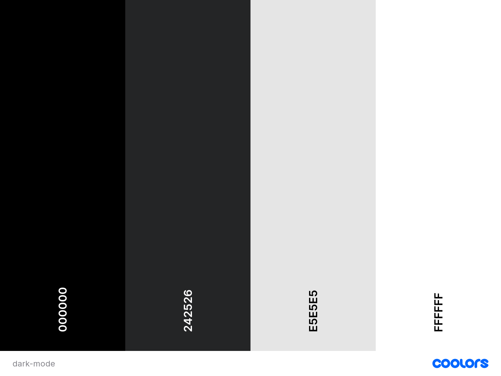
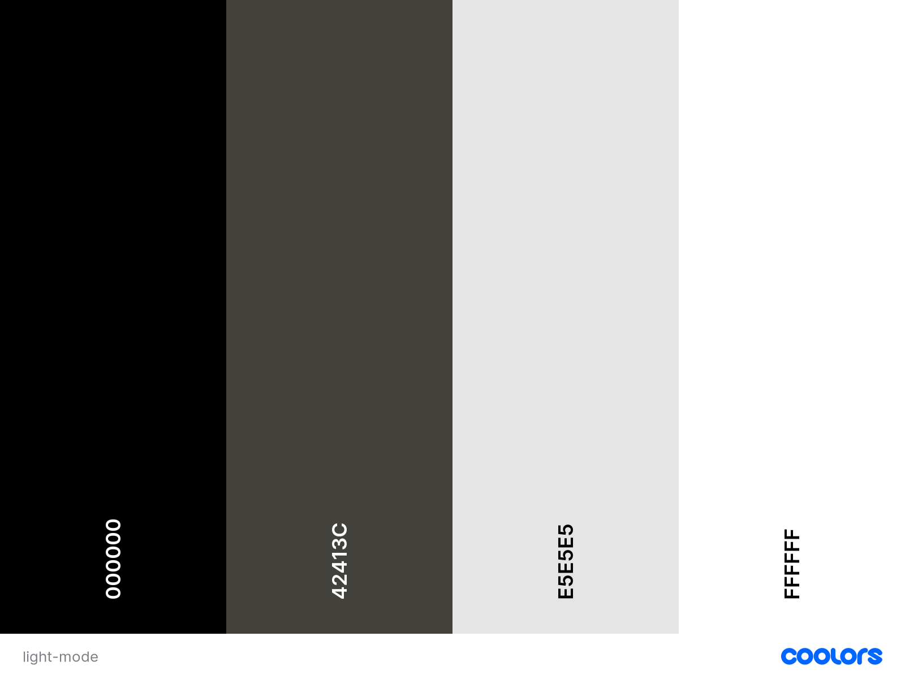
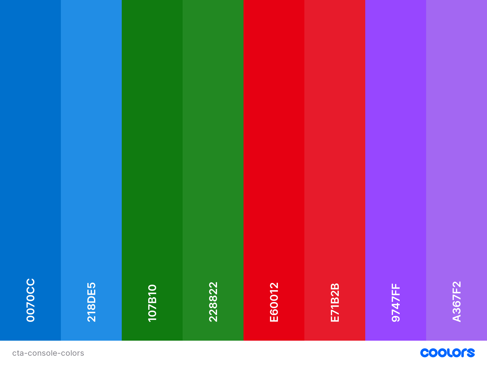
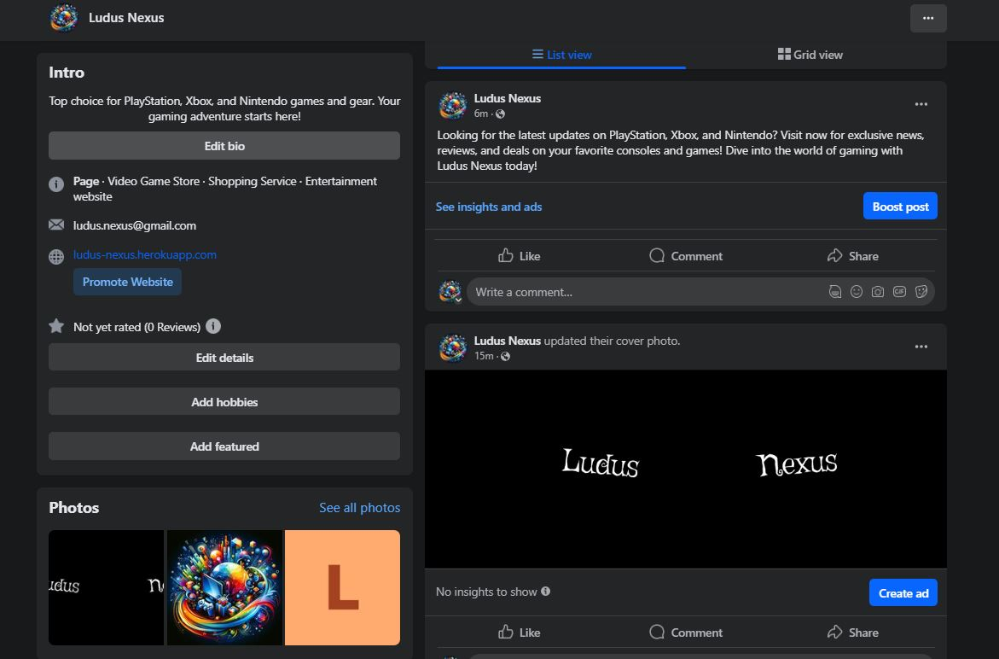
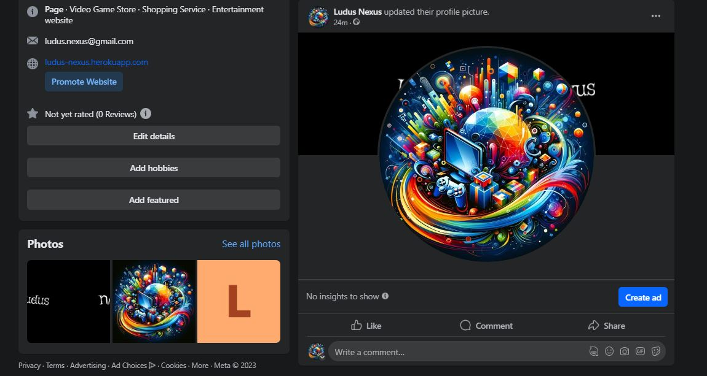
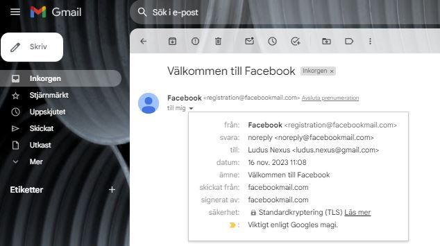
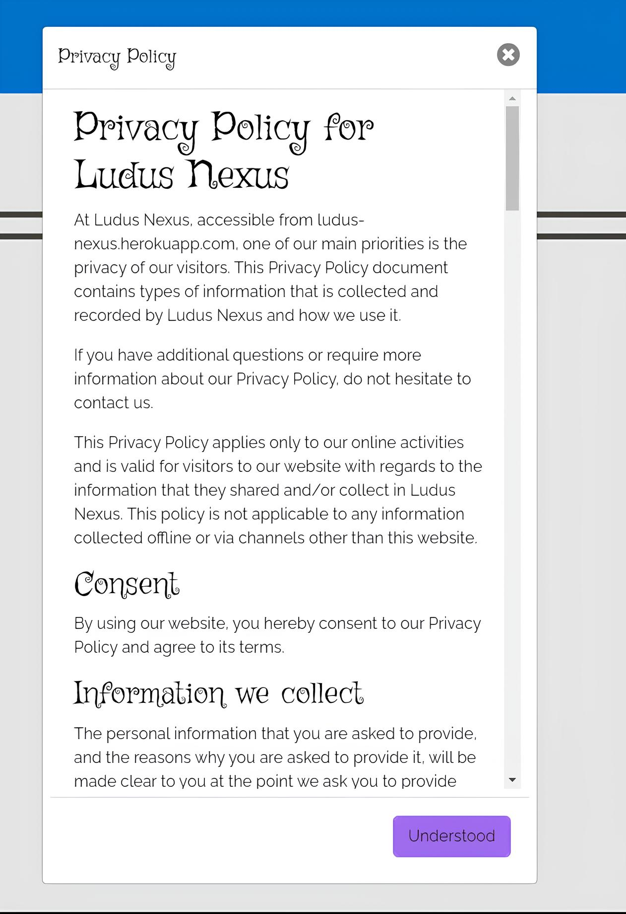

# Ludus Nexus: The Console Gaming Hub
Ludus Nexus is the go-to destination for console gamers, gaming novices, and anyone looking to find the perfect gaming-related gift. Our site is dedicated to simplifying your search for information, games, accessories, and the latest in console gaming. Designed for clarity and ease of navigation, we bring the vast gaming landscape right to your fingertips.

## For Gamers and Beyond
Ludus Nexus caters to the needs of avid gamers and casual visitors alike. We aim to create an inviting environment where discovering your next gaming experience or locating the ideal accessory is both straightforward and enjoyable. Our platform is a testament to our belief in a user-friendly experience that welcomes everyone, no matter their level of engagement with gaming.

# Core Revenue Stream
## Direct Sales
Ludus Nexus specializes in the sale of gaming consoles, video games, and gaming accessories. We generate revenue primarily through the direct online sale of these products. We ensure a competitive pricing model and a diverse range of products to cater to a broad gaming audience.

# Original Design Concept

The following design is the initial concept and starting point for the Ludus Nexus project. As we are using an agile development process, the final implementation of this site may differ from the original design concept. This flexibility allows us to adapt and refine the design based on user feedback and evolving project requirements.

The design in Figma, which can be viewed [here](https://www.figma.com/file/hGDWtjoOtL00DrgiPRRoCf/Ludus-Nexus?type=design&node-id=0%3A1&mode=design&t=1MBSYz7Agfgsb057-1), showcases the main user journey, with minor interactions detailed during the development phase. You can explore the basic idea of how the website should work on PC [here](https://www.figma.com/proto/hGDWtjoOtL00DrgiPRRoCf/Ludus-Nexus?type=design&node-id=102-2&t=lmn1KUorCpUhJ1QG-0&scaling=min-zoom&page-id=0%3A1&starting-point-node-id=102%3A2&show-proto-sidebar=1), and see what it would look like on mobile [here](https://www.figma.com/proto/hGDWtjoOtL00DrgiPRRoCf/Ludus-Nexus?type=design&node-id=548-537&t=lmn1KUorCpUhJ1QG-0&scaling=min-zoom&page-id=0%3A1&starting-point-node-id=548%3A537&show-proto-sidebar=1).

## Inspiration

The design draws inspiration from prominent gaming and technology websites, including:

- [inet](https://www.inet.se/)
- [webhallen](https://www.webhallen.com/)
- [Nintendo](https://www.nintendo.se/)
- [Playstation](https://www.playstation.com/sv-se/)
- [Xbox](https://www.xbox.com/sv-SE)
- [Youtube](https://www.youtube.com/)

These sources were instrumental in shaping the aesthetic and functional aspects of Ludus Nexus, providing insights into successful layouts and features that resonate with gaming audiences.

## Color Palette

The selected color palette reflects the essence of gaming culture, balancing visual appeal with functionality:

### Default setting - Dark Mode
- Background: Black (000000) for depth and focus.
- Text & Items Background: White (FFFFFF) for stark contrast and readability.
- Placeholder Text & HR: Grey (E5E5E5) for subtlety and clarity.
- Input Fields: Eerie Black (242526) for a sleek, modern look.

### Light Mode
- Background: Grey (E5E5E5) for a softer, eye-friendly backdrop.
- Text: Black (000000) for sharp contrast and focus on content.
- Items & Input fields: White (FFFFFF) for a clean and clear interface.
- Placeholder Text & HR: Black Olive (42413C) for a subtle yet distinct appearance.

### CTA
- CTA Colors: Veronica (9747FF) as the primary color, transitioning to Amethyst (A367F2) on hover for interactivity.

### Console Color Integration

The design embraces the vibrant identities of the selected gaming consoles by integrating their signature colors into our site's interface, enhancing user navigation and providing an instantly familiar experience for fans of each platform:

- PlayStation Blue (#0070CC) for primary display, transitioning to PlayStation Hover Blue (#218DE5) upon hover.
- Xbox Green (#107B10) for primary display, transitioning to Xbox Hover Green (#228822) upon hover.
- Nintendo Red (#E60012) for primary display, transitioning to Nintendo Hover Red (#E71B2B) upon hover.

# Design Updates
These updates are part of our continuous effort to improve user experience and website aesthetics.
1. **Mobile View Navbar:** Implemented hamburger menu functionality for a more user-friendly experience in mobile view. This replaced the previous design of circular navigation links.
2. **Navigation Menu Color in Light Mode:** Adjusted the color scheme of the navigation menu in light mode to ensure a more seamless integration with the overall page design. 
3. **Removal of Home Icon in Navbar:** After reviewing similar websites in the industry, it became apparent that a dedicated home icon is not a common practice. Most sites rely on their brand logo or name in the header to function as a home link. In aligning with these industry standards and to simplify the user interface, the decision was made to remove the home icon from our navigation. This change is expected to streamline the user experience while maintaining intuitive navigation by using our brand name in the header as the primary method to return to the home page.
4. **Updating Footer Links - Privacy Policy:** The footer links for cookies and GDPR have been consolidated into a single Privacy Policy link. This change was made to streamline the footer's content, as we do not use cookies and all GDPR-related information is comprehensively addressed in our Privacy Policy. This adjustment simplifies user access to essential privacy information.
5. **Removal of Facebook Icon from Footer:** Upon evaluating several reference pages within the industry, a common trend was observed where websites typically opt for either a Facebook logo or the text in their footer, but not both. To align with these standards and to ensure a cleaner, more streamlined user interface, we decided to remove the Facebook icon from our footer. Our footer now features only the text link to our Facebook page, simplifying the design while retaining the essential function of directing users to our social media presence.

## Fonts
- The Griffy font has been chosen for the sites title name, this is to stand out from other sites and give a memorable impression on the user.
- The Poppins font has been chosen for Playstation and Xbox titles, this is because this font resembles these branches font the most.
- The Didact Gothic font has been chosen for the Nintendo title, this is because this font resembles the Nintendo font the most.
- The Raleway font has been chosen for the overall content. It seems to match well with all the font types while still standing out.

# Database Schema
The database schema depicted below outlines the foundational structure of the Ludus Nexus e-commerce platform, detailing how various data elements such as users, products, and events are interconnected. This schema serves as a blueprint for the database's initial development, with the understanding that alterations may occur as the project evolves to accommodate new requirements or improvements.

1. **Users**: This table holds essential data about the users of the platform, such as their login credentials and contact information. It's the central point for managing user accounts and is linked to **Orders**, **EventNotifications**, and **WishList**. Allowing for functionalities like tracking order history, managing event interests, and saving favorite products.

2. **Products**: Contains detailed information about each product available on the platform, including names, descriptions, prices, and associated console types. It's linked to the **Consoles** table for categorizing products by their respective gaming consoles, enhancing user navigation and product discovery. It also connects to **OrderDetails** for order processing and **WishList** allowing users to bookmark their favorite items.

3. **Consoles**: Categorizes products based on console types like PlayStation, Xbox or Nintendo. Each entry in this table represents a different gaming console, and it's linked to **Products** to facilitate easy filtering of products based on the console type, thereby improving the user shopping experience.

4. **Orders** and **OrderDetails**: The **Orders** table manages the processing of user orders, recording essential details like order dates and total prices. The **OrderDetails** table complements this by tracking individual products within each order, including quantities and specific product IDs, ensuring accurate order fulfillment and inventory management.

5. **EventNotifications**: This table connects users with upcoming gaming events they're interested in. It links to the **Events** table and stores information about which events users want to be notified about, enabling personalized event reminders and updates.

6. **Events**: Stores comprehensive details about various gaming events, such as event names, dates, locations, and descriptions. This table is crucial for the event notification system, providing the necessary information to inform users about upcoming events that align with their interests.

7. **ProductTags** and **Tags**: These tables work together to provide a dynamic tagging system for products. **Tags** contains different labels like genres or age ratings, while **ProductTags** links these labels to specific products. This system is essential for features like product surveys, where users receive recommendations based on selected tags, and for general product categorization on the platform.

8. **NewsArticles**: Manages the display of news articles on the platform. It stores information about each article. This table is key for keeping users informed about the latest news in the gaming world, enhancing the platform's content richness.

9. **WishList**: Allows users to save products to a personal wishlist for future reference. It links to both **Users** and **Products** tables, enabling users to easily access and manage a list of products they are interested in purchasing or reviewing later.

# Facebook Page

We are excited to introduce the official Facebook page for Ludus Nexus! This is where you'll get updates on the latest in gaming and find out about special promotions for PlayStation, Xbox, and Nintendo games and gear. Stay connected and catch the best deals by following us on our Facebook page.

[Click here to visit Facebook page](https://www.facebook.com/profile.php?id=61553536475742)

Below are images showcasing the Facebook page and the dedicated business Gmail account, which is set up for customer support and inquiries:

**Top of Facebook Page**

**Middle of Facebook Page**

**Bottom of Facebook Page**

**Gmail Account**

# Features
## Privacy Policy Modal

To enhance user convenience and transparency, a Privacy Policy modal has been integrated into the footer of the site. This allows users to access information about our privacy practices and GDPR compliance without navigating away from the current page. The policy was generated using[Privacy Policy Generator](https://www.privacypolicygenerator.info/), ensuring comprehensive coverage of key privacy aspects.

**Privacy Policy Button**

 

**Privacy Policy Modal**

# Resources
- **Favicon.io**: Used for generating favicon images. [favicon.io](https://favicon.io/favicon-converter/)
- **FontAwesome**: Provides various icons used across the site. [fontawesome.com](https://fontawesome.com/)
- **Bootstrap v4.6**: Primary CSS framework used for designing the website. [getbootstrap.com](https://getbootstrap.com/docs/4.6/getting-started/introduction/)
- **JQuery**: Utilized for JavaScript coding enhancements. [jquery.com](https://jquery.com/)