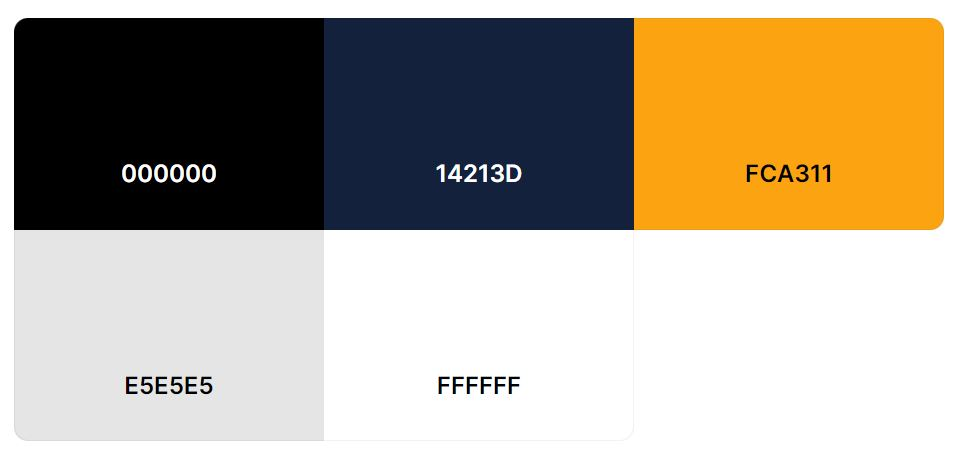

# Ludus Nexus: The Console Gaming Hub
Ludus Nexus is the go-to destination for console gamers, gaming novices, and anyone looking to find the perfect gaming-related gift. Our site is dedicated to simplifying your search for information, games, accessories, and the latest in console gaming. Designed for clarity and ease of navigation, we bring the vast gaming landscape right to your fingertips.

## For Gamers and Beyond
Ludus Nexus caters to the needs of avid gamers and casual visitors alike. We aim to create an inviting environment where discovering your next gaming experience or locating the ideal accessory is both straightforward and enjoyable. Our platform is a testament to our belief in a user-friendly experience that welcomes everyone, no matter their level of engagement with gaming.

# Core Revenue Stream
## Direct Sales
Ludus Nexus specializes in the sale of gaming consoles, video games, and gaming accessories. We generate revenue primarily through the direct online sale of these products. We ensure a competitive pricing model and a diverse range of products to cater to a broad gaming audience.

# Original Design Concept

The following design is the initial concept and starting point for the Ludus Nexus project. Since an agile development process is being used, the final implementation of this site may differ from the original design concept. The design in Figma will showcase the main user journey, minor interactions will be detailed during the development phase.

The following websites have been used as inspiration for the design.
- [inet](https://www.inet.se/)
- [webhallen](https://www.webhallen.com/)
- [Nintendo](https://www.nintendo.se/)
- [Playstation](https://www.playstation.com/sv-se/)
- [Xbox](https://www.xbox.com/sv-SE)

I have chosen the following color palette from [coolors](https://coolors.co/)

The chosen color palette was carefully selected to provide an optimal balance between visual appeal and user-friendly experience. The high contrast between black and white ensures excellent readability and accessibility. The use of grey offers a neutral background for various elements, preventing visual fatigue during prolonged browsing sessions.

The navy blue reflects the sophistication and depth associated with advanced technology and gaming, promoting user trust and engagement. Meanwhile, the striking orange for buttons is not only stylish but also creates a great contrast no matter the background.

The palette also subtly nods to the color schemes of prominent gaming consoles, providing a sense of familiarity for seasoned gamers while maintaining a unique identity for Ludus Nexus. This strategic choice in colors supports our aim to establish a brand that stands out in the competitive gaming marketplace while resonating with our core demographic.

## Default setting - Black
- Black color is being used for the background-color of the site.
- White color is being used for all the text and background-color for items.
- Grey color is being used for checkboxes and for the hr tag.
- Navy Blue color is being used for the background-color of the input boxes and the search box.
- Orange color is being used for buttons.

## White setting
- Grey color is being used for the background-color of the site.
- Black color is being used for all the text.
- White color is being used for the background-color of the events section and for the items.
- Navy Blue color is being used for the background-color of search bars, hr tag and checkboxes.
- Orange color is being used for buttons.

## Console Color Integration

Our design embraces the vibrant identities of major gaming consoles by integrating their signature colors into our site's interface. This strategic use of color serves to enhance user navigation and provide an instantly familiar experience for fans of each platform:

- **PlayStation Blue (#0070CC)**,
- **Xbox Green (#107B10)**, and
- **Nintendo Red (#E60012)**

are used consistently for interface elements related to their respective console sections, such as navigational cues, background highlights, and link colors. This not only makes for a visually cohesive environment but also leverages color psychology to foster brand connectivity and user engagement.

## Fonts
- The Griffy font has been chosen for the sites title name, this is to stand out from other sites and give a memorable impression on the user.
- The Poppins font has been chosen for Playstation and Xbox titles, this is because this font resembles these branches font the most.
- The Didact Gothic font has been chosen for the Nintendo title, this is because this font resembles the Nintendo font the most.
- The Raleway font has been chosen for the overall content. It seems to match well with all the font types while still standing out.

The design in figma can be seen here [Ludus Nexus Design idea](https://www.figma.com/file/hGDWtjoOtL00DrgiPRRoCf/Ludus-Nexus?type=design&node-id=0%3A1&mode=design&t=1MBSYz7Agfgsb057-1)

# Database Schema
The database schema depicted below outlines the foundational structure of the Ludus Nexus e-commerce platform, detailing how various data elements such as users, products, and events are interconnected. This schema serves as a blueprint for the database's initial development, with the understanding that alterations may occur as the project evolves to accommodate new requirements or improvements.

1. **Users**: This table holds essential data about the users of the platform, such as their login credentials and contact information. It's the central point for managing user accounts and is linked to **Orders**, **EventNotifications**, and **WishList**. Allowing for functionalities like tracking order history, managing event interests, and saving favorite products.

2. **Products**: Contains detailed information about each product available on the platform, including names, descriptions, prices, and associated console types. It's linked to the **Consoles** table for categorizing products by their respective gaming consoles, enhancing user navigation and product discovery. It also connects to **OrderDetails** for order processing and **WishList** allowing users to bookmark their favorite items.

3. **Consoles**: Categorizes products based on console types like PlayStation, Xbox or Nintendo. Each entry in this table represents a different gaming console, and it's linked to **Products** to facilitate easy filtering of products based on the console type, thereby improving the user shopping experience.

4. **Orders** and **OrderDetails**: The **Orders** table manages the processing of user orders, recording essential details like order dates and total prices. The **OrderDetails** table complements this by tracking individual products within each order, including quantities and specific product IDs, ensuring accurate order fulfillment and inventory management.

5. **EventNotifications**: This table connects users with upcoming gaming events they're interested in. It links to the **Events** table and stores information about which events users want to be notified about, enabling personalized event reminders and updates.

6. **Events**: Stores comprehensive details about various gaming events, such as event names, dates, locations, and descriptions. This table is crucial for the event notification system, providing the necessary information to inform users about upcoming events that align with their interests.

7. **ProductTags** and **Tags**: These tables work together to provide a dynamic tagging system for products. **Tags** contains different labels like genres or age ratings, while **ProductTags** links these labels to specific products. This system is essential for features like product surveys, where users receive recommendations based on selected tags, and for general product categorization on the platform.

8. **NewsArticles**: Manages the display of news articles on the platform. It stores information about each article. This table is key for keeping users informed about the latest news in the gaming world, enhancing the platform's content richness.

9. **WishList**: Allows users to save products to a personal wishlist for future reference. It links to both **Users** and **Products** tables, enabling users to easily access and manage a list of products they are interested in purchasing or reviewing later.