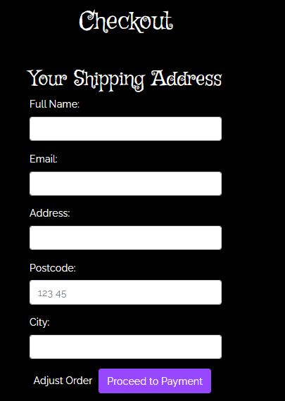
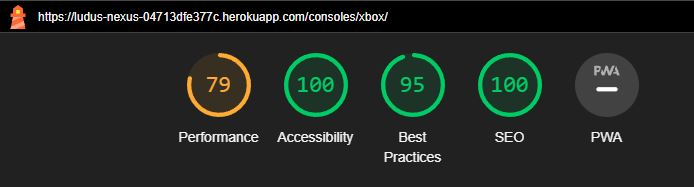

# Ludus Nexus: The Console Gaming Hub
Ludus Nexus is the go-to destination for console gamers, gaming novices, and anyone looking to find the perfect gaming-related gift. Our site is dedicated to simplifying your search for information, games, accessories, and the latest in console gaming. Designed for clarity and ease of navigation, we bring the vast gaming landscape right to your fingertips.

## For Gamers and Beyond
Ludus Nexus caters to the needs of avid gamers and casual visitors alike. We aim to create an inviting environment where discovering your next gaming experience or locating the ideal accessory is both straightforward and enjoyable. Our platform is a testament to our belief in a user-friendly experience that welcomes everyone, no matter their level of engagement with gaming.

# Core Revenue Stream
## Direct Sales
Ludus Nexus specializes in the sale of gaming consoles, video games, and gaming accessories. We generate revenue primarily through the direct online sale of these products. We ensure a competitive pricing model and a diverse range of products to cater to a broad gaming audience.

# Original Design Concept

The following design is the initial concept and starting point for the Ludus Nexus project. As we are using an agile development process, the final implementation of this site may differ from the original design concept. This flexibility allows us to adapt and refine the design based on user feedback and evolving project requirements.

The design in Figma, which can be viewed [here](https://www.figma.com/file/hGDWtjoOtL00DrgiPRRoCf/Ludus-Nexus?type=design&node-id=0%3A1&mode=design&t=1MBSYz7Agfgsb057-1), showcases the main user journey, with minor interactions detailed during the development phase. You can explore the basic idea of how the website should work on PC [here](https://www.figma.com/proto/hGDWtjoOtL00DrgiPRRoCf/Ludus-Nexus?type=design&node-id=102-2&t=lmn1KUorCpUhJ1QG-0&scaling=min-zoom&page-id=0%3A1&starting-point-node-id=102%3A2&show-proto-sidebar=1), and see what it would look like on mobile [here](https://www.figma.com/proto/hGDWtjoOtL00DrgiPRRoCf/Ludus-Nexus?type=design&node-id=548-537&t=lmn1KUorCpUhJ1QG-0&scaling=min-zoom&page-id=0%3A1&starting-point-node-id=548%3A537&show-proto-sidebar=1).

## Inspiration

The design draws inspiration from prominent gaming and technology websites, including:

- [inet](https://www.inet.se/)
- [webhallen](https://www.webhallen.com/)
- [Nintendo](https://www.nintendo.se/)
- [Playstation](https://www.playstation.com/sv-se/)
- [Xbox](https://www.xbox.com/sv-SE)
- [Youtube](https://www.youtube.com/)

These sources were instrumental in shaping the aesthetic and functional aspects of Ludus Nexus, providing insights into successful layouts and features that resonate with gaming audiences.

## Color Palette

The selected color palette reflects the essence of gaming culture, balancing visual appeal with functionality:

### Default setting - Dark Mode
- Background: Black (000000) for depth and focus.
- Text & Items Background: White (FFFFFF) for stark contrast and readability.
- Placeholder Text & HR: Grey (E5E5E5) for subtlety and clarity.
- Input Fields: Eerie Black (242526) for a sleek, modern look.

### Light Mode
- Background: Grey (E5E5E5) for a softer, eye-friendly backdrop.
- Text: Black (000000) for sharp contrast and focus on content.
- Items & Input fields: White (FFFFFF) for a clean and clear interface.
- Placeholder Text & HR: Black Olive (42413C) for a subtle yet distinct appearance.

### CTA
- CTA Colors: Veronica (9747FF) as the primary color, transitioning to Amethyst (A367F2) on hover for interactivity.

### Console Color Integration

The design embraces the vibrant identities of the selected gaming consoles by integrating their signature colors into our site's interface, enhancing user navigation and providing an instantly familiar experience for fans of each platform:

- PlayStation Blue (#0070CC) for primary display, transitioning to PlayStation Hover Blue (#218DE5) upon hover.
- Xbox Green (#107B10) for primary display, transitioning to Xbox Hover Green (#228822) upon hover.
- Nintendo Red (#E60012) for primary display, transitioning to Nintendo Hover Red (#E71B2B) upon hover.

# Design Updates
These updates are part of our continuous effort to improve user experience and website aesthetics.
1. **Mobile View Navbar:** Implemented hamburger menu functionality for a more user-friendly experience in mobile view. This replaced the previous design of circular navigation links.
2. **Navigation Menu Color in Light Mode:** Adjusted the color scheme of the navigation menu in light mode to ensure a more seamless integration with the overall page design. 
3. **Removal of Home Icon in Navbar:** After reviewing similar websites in the industry, it became apparent that a dedicated home icon is not a common practice. Most sites rely on their brand logo or name in the header to function as a home link. In aligning with these industry standards and to simplify the user interface, the decision was made to remove the home icon from our navigation. This change is expected to streamline the user experience while maintaining intuitive navigation by using our brand name in the header as the primary method to return to the home page.
4. **Updating Footer Links - Privacy Policy:** The footer links for cookies and GDPR have been consolidated into a single Privacy Policy link. This change was made to streamline the footer's content, as we do not use cookies and all GDPR-related information is comprehensively addressed in our Privacy Policy. This adjustment simplifies user access to essential privacy information.
5. **Removal of Facebook Icon from Footer:** Upon evaluating several reference pages within the industry, a common trend was observed where websites typically opt for either a Facebook logo or the text in their footer, but not both. To align with these standards and to ensure a cleaner, more streamlined user interface, we decided to remove the Facebook icon from our footer. Our footer now features only the text link to our Facebook page, simplifying the design while retaining the essential function of directing users to our social media presence.
6. **Integration of a Modal for Newsletter Subscription in the Footer:** The design was updated to include a modal-trigger button for newsletter subscriptions, replacing the direct input field in the footer. This change was made to ensure a cohesive and uniform design. The modal provides a focused and user-friendly interface for newsletter sign-up, enhancing the overall user experience."
7. **Reintroduction of Home Icon after user testing:** The home icon was re-added to the navigation for enhanced user accessibility and intuitive navigation, especially for users less familiar with web conventions. Recognizing that not all users may intuitively click on the header to return to the home page, the home icon provides a clear, alternative navigation option. Additionally, the header links on each console page have been updated to correspond to their specific pages, improving the user experience in the mobile version where the main navigation is hidden behind a hamburger menu." 

## Fonts
- The Griffy font has been chosen for the sites title name, this is to stand out from other sites and give a memorable impression on the user.
- The Poppins font has been chosen for Playstation and Xbox titles, this is because this font resembles these branches font the most.
- The Didact Gothic font has been chosen for the Nintendo title, this is because this font resembles the Nintendo font the most.
- The Raleway font has been chosen for the overall content. It seems to match well with all the font types while still standing out.

# Database Schema
The database schema depicted below outlines the foundational structure of the Ludus Nexus e-commerce platform, detailing how various data elements such as users, products, and events are interconnected. This schema serves as a blueprint for the database's initial development, with the understanding that alterations may occur as the project evolves to accommodate new requirements or improvements.

1. **Users**: This table holds essential data about the users of the platform, such as their login credentials and contact information. It's the central point for managing user accounts and is linked to **Orders**, **EventNotifications**, and **WishList**. Allowing for functionalities like tracking order history, managing event interests, and saving favorite products.

2. **Products**: Contains detailed information about each product available on the platform, including names, descriptions, prices, and associated console types. It's linked to the **Consoles** table for categorizing products by their respective gaming consoles, enhancing user navigation and product discovery. It also connects to **OrderDetails** for order processing and **WishList** allowing users to bookmark their favorite items.

3. **Consoles**: Categorizes products based on console types like PlayStation, Xbox or Nintendo. Each entry in this table represents a different gaming console, and it's linked to **Products** to facilitate easy filtering of products based on the console type, thereby improving the user shopping experience.

4. **Orders** and **OrderDetails**: The **Orders** table manages the processing of user orders, recording essential details like order dates and total prices. The **OrderDetails** table complements this by tracking individual products within each order, including quantities and specific product IDs, ensuring accurate order fulfillment and inventory management.

5. **EventNotifications**: This table connects users with upcoming gaming events they're interested in. It links to the **Events** table and stores information about which events users want to be notified about, enabling personalized event reminders and updates.

6. **Events**: Stores comprehensive details about various gaming events, such as event names, dates, locations, and descriptions. This table is crucial for the event notification system, providing the necessary information to inform users about upcoming events that align with their interests.

7. **ProductTags** and **Tags**: These tables work together to provide a dynamic tagging system for products. **Tags** contains different labels like genres or age ratings, while **ProductTags** links these labels to specific products. This system is essential for features like product surveys, where users receive recommendations based on selected tags, and for general product categorization on the platform.

8. **NewsArticles**: Manages the display of news articles on the platform. It stores information about each article. This table is key for keeping users informed about the latest news in the gaming world, enhancing the platform's content richness.

9. **WishList**: Allows users to save products to a personal wishlist for future reference. It links to both **Users** and **Products** tables, enabling users to easily access and manage a list of products they are interested in purchasing or reviewing later.

# Update to Database

**ProductTags** has been removed in favor of Django's *ManyToManyField* in **Tags**, simplifying the management of product-tag relationships.

# Facebook Page

We are excited to introduce the official Facebook page for Ludus Nexus! This is where you'll get updates on the latest in gaming and find out about special promotions for PlayStation, Xbox, and Nintendo games and gear. Stay connected and catch the best deals by following us on our Facebook page.

[Click here to visit Facebook page](https://www.facebook.com/profile.php?id=61553536475742)

Below are images showcasing the Facebook page and the dedicated business Gmail account, which is set up for customer support and inquiries:

**Top of Facebook Page**

**Middle of Facebook Page**

**Bottom of Facebook Page**

**Gmail Account**

**Call to Action (CTA) on Facebook:** This feature was not implemented. While exploring options for adding a CTA button on Facebook, I encountered several choices. However, it was unclear whether these options would incur charges, and none matched the straightforward approach demonstrated in the tutorial video. To avoid potential costs and complexity, I decided not to implement a Facebook CTA button at this stage.

# Features
## Privacy Policy Modal

To enhance user convenience and transparency, a Privacy Policy modal has been integrated into the footer of the site. This allows users to access information about our privacy practices and GDPR compliance without navigating away from the current page. The policy was generated using[Privacy Policy Generator](https://www.privacypolicygenerator.info/), ensuring comprehensive coverage of key privacy aspects.

**Privacy Policy Button**

 

**Privacy Policy Modal**

## 404 Error Page
Our website includes a custom 404 error page designed to clearly communicate to users when they have encountered a non-existent page or a broken link. The page features a clear and concise message, "PAGE NOT WORKING," ensuring users are immediately aware of the error.
The 404 page also includes a prominent Home button. This feature allows users to easily navigate back to the main content of the site.

## Newsletter Signup
A user-friendly newsletter signup modal has been integrated into the footer. This modal enables visitors to subscribe to our newsletter easily.

**Registration Process:** Users can enter their email address in the modal to subscribe.

**Feedback on Subscription:**

- A confirmation message appears for successful signups.

- An alert notifies users if they are already subscribed.

- An error message is displayed for invalid email inputs.

- A prompt indicates if the email field is left empty.

In addition to the frontend features, all subscriptions are conveniently managed and visible in the MailChimp database, allowing for efficient user engagement and communication tracking.

# Theme Change
To enhance user experience, our website remembers the user's theme preference across browsing sessions. This is achieved by utilizing the browser's localStorage feature:

**Local Storage for Preferences**: When a user selects a theme, their choice is saved in the browser’s local storage. This means the next time they visit the website, it will automatically display their preferred theme, providing a consistent and personalized experience.

**No Login Required**: This functionality works without the need for user accounts or logging in, ensuring ease of use and immediate personalization for every visitor.

**Privacy-Friendly**: The use of local storage means that the theme preference is stored locally on the user's device, respecting their privacy and not requiring any server-side data storage or processing.

This simple yet effective use of local storage ensures that users enjoy a tailored browsing experience every time they visit our site.

# Products
Visitors to Ludus Nexus can easily explore a wide range of gaming products tailored for Playstation, Xbox, and Nintendo, directly accessible from the navbar.

## Efficient Navigation & Detailed Insights:

- **Subcategories:** Each product page can be neatly categorized into three sections: Games, Consoles, and Accessories, offering a streamlined browsing experience. Allowing users to filter the displayed products, makes it easier to find items aligned with their interests.

- **Product Descriptions:** Each product features a "Describe" button. Clicking on this provides a concise description, offering insights into the product's features and appeal.

- **Product Header:** The header dynamically adjusts based on the current page, ensuring a seamless experience across devices in addition to enabling the mobile users to reset the view and see all available products with ease.

# Staff Registration and Management

**Staff:** A staff can be registered by an existing admin. This registration can only be done from Django Admin Panel.

Once the user is created, you are directed to a more detailed view, where you can add more user detail and which permissions they should have. An admin group has been created with full priviledge. More groups can be made with specific permissions if needed.

The staff member can log-in to their account through the website via the regular login button in the navbar which users also have access to. The sign-in also has a remember me tickbox.

Once they are logged in, they can access the Django Admin panel via the previous login button that has now become an account button. The admin panel inside the account button is only available to staff members.

Once logged in depending on their permissions they have access to all content through the databases.

All changes made will show immediately on page.

# User Experience

The initial interface presents an overview of the site, encouraging new users to create accounts for a personalized experience.
Essential links like the privacy policy, contact information, and newsletter signup are located in the footer for easy access.

Users can select from Playstation, Xbox, or Nintendo categories via the navbar. Each product section includes subcategories for Games, Consoles, and Accessories, with filtering functionality.

The shopping cart icon in the navbar changes to purple when items are added, signaling items in the cart.

The shopping bag page allows users to review their selections, adjust quantities, remove items, and see the subtotal for each product and the total cost.

A straightforward checkout process where users fill in shipping details.

Stripe integration is used for secure payment processing. The interface provides feedback for successful transactions and input errors.

Post-purchase, users receive an order confirmation with a unique order number. Registered users can access their order history and receipts.

The site includes functionalities for account management, including logout, viewing past orders, and account deletion, with confirmation prompts for safety.

The sign-in page provides options for new account creation and password recovery.

# Testing

## HTML
W3C Markup Validation Service, a tool for checking the markup validity of web documents in HTML, was utilized to ensure that the website conforms to web standards.

**The validator showed the following errors :**

404 Page - Errors

Home Page - Errors

*Newsletter Page - It is warning against misuse of aria-labels but the code is from Mailchimp and it wont work as intended without it.*

Product Pages - Errors

Product Pages - Warnings

## Lighthouse

Lighthouse is an open-source tool for improving the quality of web pages. It provides audits for performance, accessibility, progressive web apps, and more. Below are the Lighthouse test results for the Ludus Nexus website.

**Chrome is blocking third-party cookies to protect user data from cross-site tracking. This is preventing me from getting full marks in lighthouse. It is blocking stripe**

**404 Page - Desktop View**

**404 Page - Mobile View**

**Home Page - Desktop View**

**Home Page - Mobile View**

**Product Page - Desktop View**

**Product Page - Mobile View**

**Sign In Page - Desktop View**

**Sign In Page - Mobile View**

**Sign Up Page - Desktop View**

**Sign Up Page - Mobile View**

**Empty Shopping Bag Page - Desktop View**

**Empty Shopping Bag - Mobile View**

**Sign Out Page - Desktop View**

**Sign Out Page - Mobile View**

**Order History Page - Desktop View**

**Order History Page - Mobile View**

**Order Receipt Page - Desktop View**

**Order Receipt Page - Mobile View**

**Delete Account Page - Desktop View**

**Delete Account Page - Mobile View**

**Full Bag Page - Desktop View**

**Full Bag Page - Mobile View**

# Deployment to Heroku

This README outlines the steps necessary to deploy an application to Heroku. It is designed as a guide for users looking to deploy their own applications using Heroku's platform.

## Pre-Requisites

**Before beginning, ensure you have a Heroku account!**

**Note:** The screenshots in this guide are from a project named "Azure Bistro". Please ensure you are using the correct project name for your application, which in this case is "Ludus Nexus", when you follow these deployment steps.

## Steps for Deployment

1.  **Create a New App:**
 - Click on the *new* button in the upper right corner of the Heroku dashboard.
 - Select *Create new app*.

2. **App Name and Region:**
- Choose an app name. 
- Select a region closest to you for optimal performance.
- Click on *Create app* to confirm.

3. **Connecting to GitHub:**
- In the *Deploy* section of your app, select *GitHub* as the *Deployment method*.
- In *Connect to GitHub*, type in the name of your GitHub project.
- Click *Connect* next tot the project you wish to deploy.

4. Manual Deployment
- Scroll down to *Manual deploy* and click on the *Deploy Branch* button to initiate the deployment process.

# Unfixed Bugs
1. **Mailchimp Subscription Messages Bug:** The Mailchimp subscription form messages (success, error, etc.) do not reset after the modal is closed; they persist until the page is fully reloaded. Despite attempts to override Mailchimp's JavaScript functionality to reset these messages, the issue remains unresolved. The bug has been acknowledged and requires further investigation.

# Resources
- **Favicon.io**: Used for generating favicon images. [favicon.io](https://favicon.io/favicon-converter/)
- **FontAwesome**: Provides various icons used across the site. [fontawesome.com](https://fontawesome.com/)
- **Bootstrap v4.6**: Primary CSS framework used for designing the website. [getbootstrap.com](https://getbootstrap.com/docs/4.6/getting-started/introduction/)
- **JQuery**: Utilized for JavaScript coding enhancements. [jquery.com](https://jquery.com/)
- **Stripe**: Using Stripe as a payment system. [Stripe](https://stripe.com/docs)

# Documentation and Websites Used
 - [MDN - Event Listener](https://developer.mozilla.org/en-US/docs/Web/API/EventTarget/addEventListener)
 - [MDN - DOM Introduction](https://developer.mozilla.org/en-US/docs/Web/API/Document_Object_Model/Introduction)
 - [MDN - Events](https://developer.mozilla.org/en-US/docs/Web/Events)
 - [MDN - Storage](https://developer.mozilla.org/en-US/docs/Web/API/Storage)
 - [MDN - Web Storage API](https://developer.mozilla.org/en-US/docs/Web/API/Web_Storage_API)
 - [Django Project - Form Validation](https://docs.djangoproject.com/en/4.2/topics/forms/#:~:text=,and%20Form%20and%20field%20validation)
 - [Django Project - Forms](https://docs.djangoproject.com/en/4.2/ref/forms/)
 - [Django Project - Form API](https://docs.djangoproject.com/en/4.2/ref/forms/api/#:~:text=,set%20of%20data%2C%20or%20unbound)
 - [Django Project - Form Fields](https://docs.djangoproject.com/en/4.2/ref/forms/fields/)
